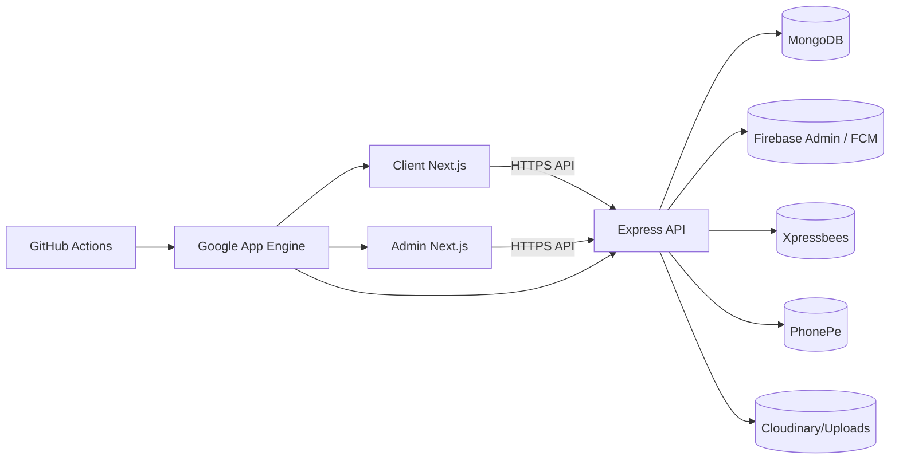
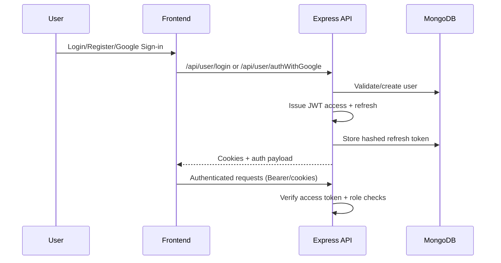
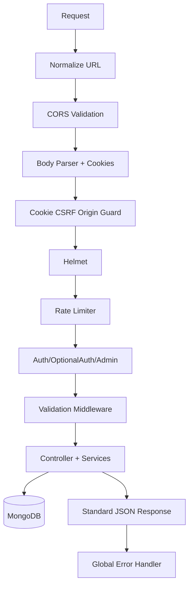

# bogEcom

Production-focused MERN commerce platform with:
- Storefront (`frontend/client`)
- Admin panel (`frontend/admin`)
- API and background jobs (`server`)

The repository is structured for real-world operations: auth, checkout, coins, membership, shipping, invoices, support tickets, and App Engine deployment.

## System Architecture


## Monorepo Structure
```text
bogEcom/
  frontend/
    client/                  # Customer storefront (Next.js)
    admin/                   # Admin dashboard (Next.js)
  server/                    # Express API, models, services, jobs
  .github/workflows/         # CI + deployment automation
  scripts/                   # Repo-level automation scripts
  dispatch.yaml              # App Engine dispatch routing
```

## Backend Overview
- Entry: `server/index.js`
- Data layer: Mongoose models in `server/models`
- API composition: route modules in `server/routes`
- Business logic: controllers + service layer in `server/controllers` and `server/services`
- Security middleware:
  - `helmet`, `cors`, `cookie-parser`
  - rate limits in `server/middlewares/rateLimiter.js`
  - auth/admin guards in `server/middlewares/auth.js` and `server/middlewares/admin.js`
  - cookie-CSRF origin guard in `server/middlewares/csrfGuard.js`
- Error stack:
  - centralized helpers in `server/utils/errorHandler.js`
  - 404 and global error middleware in `server/index.js`
- Background jobs:
  - reservation expiry
  - membership expiry
  - location log retention
  - Xpressbees polling fallback

## Frontend Overview
### Client (`frontend/client`)
- Next.js App Router storefront
- Checkout, cart, wishlist, policy pages, membership, account, orders
- Firebase auth integration for Google sign-in
- Shared API utility and hooks for token/session handling

### Admin (`frontend/admin`)
- Next.js App Router admin console
- Product/category/banner/blog/content management
- Order and support workflows
- Membership and coin settings management
- Shipping and operational settings screens

## Authentication Flow


### Security Notes
- Refresh tokens are now stored hashed (`server/utils/tokenHash.js`) with backward-compatible verification.
- Logout now invalidates refresh tokens reliably even when only refresh cookie is present.
- Password reset OTP expiry logic uses proper timestamp comparison.
- Backup password and password reset flows enforce password complexity.
- JWT secrets are length-validated and access/refresh secrets must differ.

## E-commerce Logic

### Cart System
- Guest + user carts
- Stock-aware add/update
- Variant-aware checks
- Merge logic hardened to cap quantity and skip unavailable products

### Wishlist
- Auth-required wishlist operations
- Product ID validation and active-product enforcement
- Safe move-to-cart with stock and quantity caps

### Membership
- Admin-managed plans (`MembershipPlan`)
- Payment integration path via PhonePe (feature-flagged)
- Membership activation and expiry tracked in DB
- Membership discount dynamically applied during checkout calculations

### Coins
- Dynamic coin settings (`CoinSettings`)
- Earn/redeem/expire ledger (`CoinTransaction`)
- FIFO redemption and idempotency safeguards
- Membership bonus multiplier support
- Server-side caps and validation to prevent frontend manipulation

### Shipping (Xpressbees + fallback)
- Quote endpoint with pincode validation
- Xpressbees booking/tracking/cancel/manifest/NDR/reverse flows
- Webhook support with optional secret validation
- Polling fallback for tracking resiliency

### Guest Checkout
- Guest details normalized + validated in middleware
- Backend remains source-of-truth for order totals, discounts, and inventory

## API Flow and Middleware Chain


## CI/CD

### Quality Pipeline (`.github/workflows/ci.yml`)
- Validates env example files
- Runs backend tests
- Builds client and admin
- Runs lint checks (non-blocking step due existing lint debt)

### Deployment Pipelines
- `deploy-client.yml`: deploys `frontend/client` to App Engine `client` service
- `deploy-admin.yml`: deploys `frontend/admin` to App Engine `admin` service
- `deploy-backend.yml`: deploys `server` to App Engine `default` service

All deploy workflows:
- authenticate using service account secret
- build temporary deploy yaml with injected env vars
- deploy via `gcloud app deploy`
- cleanup generated yaml artifacts

## Environment Variables

### Backend (`server/.env`)
| Variable | Required | Purpose |
|---|---|---|
| `NODE_ENV` | Yes | Runtime mode (`development`/`production`) |
| `PORT` | Yes | API listen port |
| `MONGO_URI` | Yes | MongoDB connection string |
| `ACCESS_TOKEN_SECRET` | Yes | Access JWT secret (32+ chars) |
| `REFRESH_TOKEN_SECRET` | Yes | Refresh JWT secret (32+ chars) |
| `CLIENT_URL` | Yes | Allowed storefront origin(s) |
| `ADMIN_URL` | Yes | Allowed admin origin(s) |
| `CORS_ORIGINS` | No | Extra comma-separated CORS origins |
| `COOKIE_DOMAIN` | No | Cookie domain override in production |
| `EMAIL`, `EMAIL_PASSWORD` | No | SMTP for OTP/support |
| `PHONEPE_*` | Conditional | PhonePe integration |
| `XPRESSBEES_*` | Conditional | Xpressbees integration |
| `FIREBASE_*` | Conditional | Firebase Admin/FCM |
| `CLOUDINARY_*` | Optional | Media storage integration |

### Client (`frontend/client/.env.local`)
| Variable | Required | Purpose |
|---|---|---|
| `NEXT_PUBLIC_API_URL` | Yes | API base URL |
| `NEXT_PUBLIC_APP_API_URL` | No | Explicit app API override |
| `NEXT_PUBLIC_SITE_URL` | Yes | Public canonical site URL |
| `NEXT_PUBLIC_FIREBASE_*` | Conditional | Firebase Web SDK config |
| `NEXT_PUBLIC_FIREBASE_VAPID_KEY` | Optional | Push messaging |
| `NEXT_PUBLIC_GOOGLE_MAPS_API_KEY` | Optional | Maps/address helpers |

### Admin (`frontend/admin/.env.local`)
| Variable | Required | Purpose |
|---|---|---|
| `NEXT_PUBLIC_API_URL` | Yes | API base URL |
| `NEXT_PUBLIC_FIREBASE_*` | Conditional | Firebase Web SDK config |
| `NEXT_PUBLIC_FIREBASE_MEASUREMENT_ID` | Optional | Analytics |

## Local Development

1. Install dependencies:
```bash
cd server && npm ci
cd ../frontend/client && npm ci
cd ../admin && npm ci
```

2. Configure env files from examples:
- `server/.env`
- `frontend/client/.env.local`
- `frontend/admin/.env.local`

3. Run services:
```bash
cd server && npm run dev
cd frontend/client && npm run dev
cd frontend/admin && npm run dev
```

4. Validate env docs:
```bash
node scripts/validate-env-examples.mjs
```

## Production Setup (App Engine)

1. Configure GitHub secrets required by deploy workflows.
2. Push to `main` (path-based workflows deploy changed service).
3. Optionally run `workflow_dispatch` for manual deploy.
4. Verify App Engine traffic split and health checks.

## Docker Support
- Backend container spec added:
  - `server/Dockerfile`
  - `server/.dockerignore`

Example build/run:
```bash
cd server
docker build -t bogecom-api .
docker run --env-file .env -p 8080:8080 bogecom-api
```

## Security Measures Implemented
- Hashed refresh token persistence and secure verification
- JWT secret strength enforcement
- CORS allowlist enforcement
- Cookie-auth CSRF origin guard for mutating routes
- Helmet security headers
- Route-level rate limiting
- Input validation and sanitization in key checkout/support/auth paths
- Admin route protection with auth + role checks
- Global error handling and controlled error responses in production

## Performance and Reliability
- Mongoose indexes on key query paths (orders/products/coins/wishlist/support/etc.)
- Shipping config caching and settings cache
- Idempotent coin and inventory operations
- Reservation expiry jobs for stale checkouts
- Firestore sync hooks for realtime visibility

## API Documentation (High-level)

### Auth/User
- `POST /api/user/register`
- `POST /api/user/login`
- `POST /api/user/refresh-token`
- `GET /api/user/logout`
- `POST /api/user/authWithGoogle`

### Orders/Checkout
- `POST /api/orders`
- `POST /api/orders/save-for-later`
- `GET /api/orders/payment-status`
- `POST /api/orders/webhook/phonepe`

### Membership/Coins
- `GET /api/membership/active`
- `POST /api/membership/create-order`
- `POST /api/membership/verify-payment`
- `GET /api/coins/settings/public`
- `GET /api/user/coins-summary`

### Shipping
- `POST /api/shipping/quote`
- `GET /api/shipping/display-metrics`
- `POST /api/webhooks/expressbees`

### Admin
- `GET /api/orders/admin/all`
- `PATCH /api/admin/orders/:id/status`
- `GET /api/settings/admin/all`
- `GET /api/support/admin/all`

## Current Gaps / Future Improvements
- Gradually convert client/admin lint warnings into blocking CI
- Add Redis cache for rate-limits/session-scale
- Add queue workers (BullMQ) for async jobs and retries
- Add structured logging transport (Winston + GCP logging)
- Add Prometheus/OpenTelemetry metrics and alerting
- Break out auth and notification services for microservice evolution

## Additional Study Material
- Deep technical walkthrough: `PROJECT_DEEP_STUDY_GUIDE.md`

